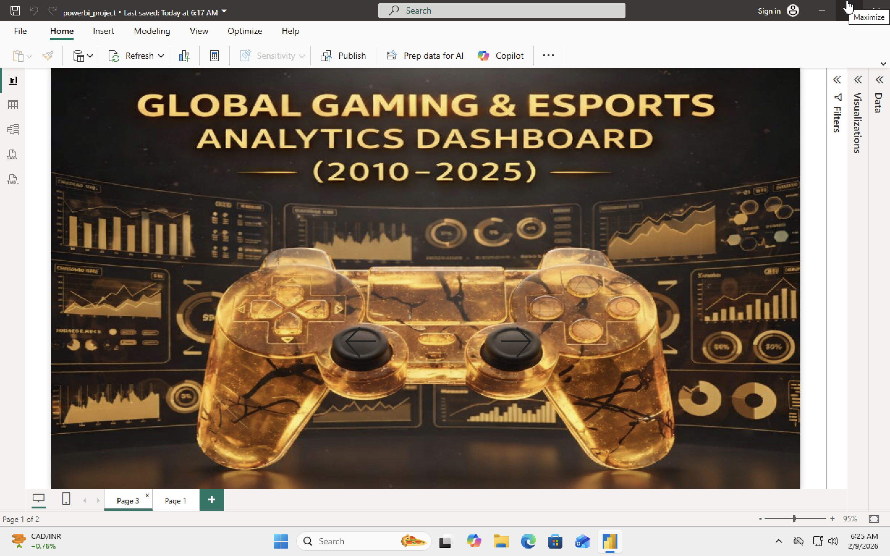
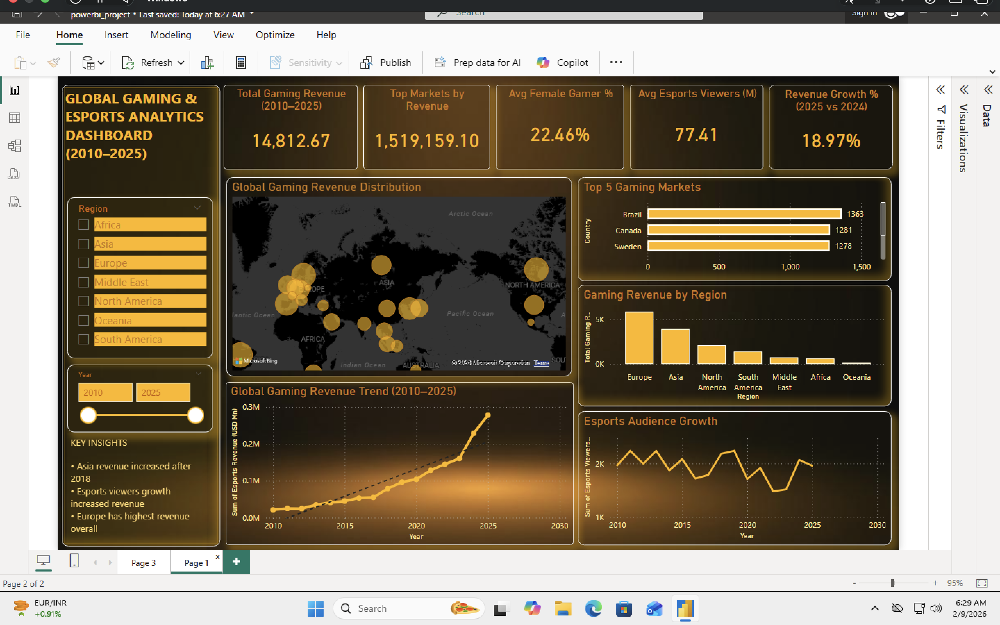

# Global Gaming & Esports Analytics Dashboard (2010–2025)

## Project Overview
This project analyzes global gaming and esports industry growth trends using Power BI. The dashboard is designed to visualize revenue patterns, platform performance, regional comparisons, and industry-level KPIs to better understand market growth over time.

## Objective
The goal of this project is to explore gaming and esports industry data and identify meaningful trends related to:
- Industry revenue growth
- Platform-wise market performance
- Regional comparisons
- Overall market expansion from 2010 to 2025

## Tools Used
- Power BI
- DAX
- Data Visualization
- Data Cleaning
- KPI Reporting

## Dataset
Source: Kaggle - Global Gaming & Esports Growth Dataset

The dataset includes information related to gaming and esports industry performance, such as revenue trends, platforms, regions, and market growth indicators.

## Dashboard Features
- Revenue growth analysis
- Platform market share
- Regional performance comparison
- Interactive filters and KPIs

## Key Insights
- Tracked the growth of the gaming and esports industry over time
- Compared platform-wise market performance
- Identified differences in regional contribution and performance
- Used KPI indicators to summarize overall industry trends

## Business Questions Answered
- How has the gaming and esports market grown over time?
- Which platforms contribute most to market performance?
- How does industry performance vary by region?
- What trends can be identified from overall market KPIs?

## Dashboard Preview

## 🎥 Dashboard Demo

[https://github.com/YOUR-USERNAME/YOUR-REPO/assets/your-video-link
](https://github.com/workwithhebah-bit/gaming-esports-powerbi-dashboard/blob/main/Gdashboard_preview_R.mov)

### Dashboard Page 1

### Dashboard Page 2

## Files Included
- powerbi_project.pbix → Power BI dashboard file
- global_gaming_esports_2010_2025.csv → Dataset
- dashboard_preview1.png → Dashboard screenshot (Page 1)
- dashboard_preview2.png → Dashboard screenshot (Page 2)
- README.md` → Project documentation

## Outcome
This project helped strengthen my skills in:
- Power BI dashboard creation
- KPI-based reporting
- DAX usage
- Trend analysis and business storytelling through data
